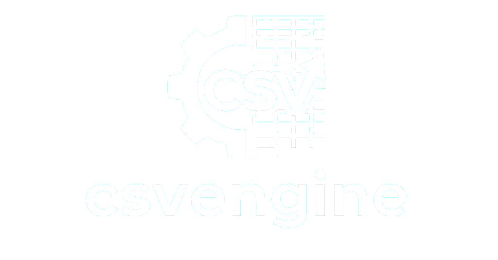

<p align="center">

</p>

# csvengine

*A personal learning project with C++20 exploring high-performance CSV parsing techniques.*


## About This Project

`csvengine` is a personal learning project, developed in spare time to deepen my expertise in modern C++20 features (concepts, ranges, `std::from_chars`), low-level performance engineering (SIMD intrinsics, memory-mapped I/O, zero-copy parsing), and library design topics that don't typically come up in my day job.

The codebase is ***not production-hardened***: it lacks fuzzing, sanitizer-enabled CI, full cross-platform testing, and complete error reporting. These are conscious trade-offs given the time budget. See Roadmap for what's intentionally missing.

What it does demonstrate: spec-driven design, iterative refactoring, benchmark-driven optimization, and architectural reasoning around performance trade-offs.

`csvengine` parses RFC 4180 compliant CSV files. The implementation explores trade-offs between OOP design and low-level performance: SIMD (SSE2), memory-mapped I/O, and zero-copy string views, reaching `~1.73M rows/sec` on commodity hardware in benchmark scenarios.

## Table of Contents
- [Features](#features)
- [Performance Benchmarks](#performance-benchmarks)
- [Requirements](#requirements)
- [Quick Start](#quick-start)
- [Building the Project](#building-the-project)
- [API Reference](#api-reference)
- [Usage Examples](#usage-examples)
- [Building from Source](#building-from-source)
- [Testing](#testing)
- [Benchmarks](#benchmarks)
- [Project Structure](#project-structure)
- [Roadmap](#roadmap)
- [License](#license)

## Technical Highlights

| Feature | Description |
|---------|-------------|
| **RFC 4180 Compliant** | Full support for quoted fields, embedded newlines, escaped quotes |
| **Hardware Acceleration** | SIMD (SSE2) structural scanning for massive throughput gains |
| **Streaming & Mmap** | Constant $O(\text{record.size()})$ memory usage + OS page caching (`mmap`) |
| **Zero-Copy Parsing** | `RecordView` utilizing `std::string_view` to eliminate memory allocations |
| **Type-Safe Conversions** | `row.get<T>("age")` returns `std::optional<T>` (using C++17 `from_chars`) |
| **Modern C++20** | Concepts, `string_view`, ranges-compatible iterators |
| **Flexible Access** | Access fields by index `row[0]` or column name `row["name"]` |
| **Configurable** | Custom delimiters, quote chars, line endings (LF/CRLF/CR) |
| **Strict & Lenient Modes** | Choose between RFC-strict parsing or forgiving real-world mode |
| **Zero Dependencies** | Only standard library (GoogleTest/Benchmark for development) |

## Performance Benchmarks

For detailed information about performance analysis, buffer tuning, and the impact of SIMD and Zero-Copy, please read [BENCHMARKING.md](./BENCHMARKING.md).

**Peak Performance Highlight:**  
Combining the `SimdParser` with `RecordView` (Zero-Copy) and Memory Mapped files (`MappedBuffer`) yields parsing speeds exceeding **1.73 Million rows per second** (~38 MB/s) on standard laptop hardware.

## API Reference

### `csv::Reader` and `csv::ViewReader`

| Method | Description |
|--------|-------------|
| `Reader(path, config)` | Construct from file path (standard `std::string` fields) |
| `ViewReader(path, config)` | Construct Zero-Copy reader (`std::string_view` fields) |
| `next()` | Advance to next record, returns `false` at EOF |
| `current_record()` | Get current `Record` or `RecordView` reference |
| `headers()` | Get column names (if `has_header=true`) |
| `line_number()` | Current line number (1-indexed) |
| `record_size()` | Number of fields per record |
| `good()` | Check if reader is in valid state |
| `begin()` / `end()` | Range-based for loop support |

### `csv::Record`

| Method | Description |
|--------|-------------|
| `get<T>(index)` | Get field by index as `std::optional<T>` |
| `get<T>(name)` | Get field by column name as `std::optional<T>` |
| `at(index)` | Get field by index, throws on out-of-range |
| `at(name)` | Get field by name, throws if not found |
| `operator[](index)` | Direct access by index (no bounds check) |
| `operator[](name)` | Direct access by name (throws if not found) |
| `fields()` | Get all fields as vector |
| `size()` | Number of fields |
| `empty()` | Check if record has no fields |

### `csv::Config`

| Field | Type | Default | Description |
|-------|------|---------|-------------|
| `delimiter` | `char` | `,` | Field separator |
| `has_header` | `bool` | `true` | First row contains column names |
| `has_quoting` | `bool` | `true` | Enable quoted field parsing |
| `quote_char` | `char` | `"` | Quote character |
| `use_simd` | `bool` | `false` | Enable SSE2 hardware acceleration (unquoted only) |
| `mapped_buffer` | `bool` | `false` | Use `mmap` instead of `std::ifstream` |
| `parse_mode` | `ParseMode` | `strict` | `strict` or `lenient` |
| `line_ending` | `LineEnding` | `lf` | `lf`, `crlf`, or `cr` |
| `record_size_policy` | `RecordSizePolicy` | `strict_to_first` | Field count validation |
| `record_size` | `size_t` | `0` | Expected fields (for `strict_to_value`) |

### Supported Types for `get<T>()`

- `std::string`, `std::string_view`
- `int`, `long`, `long long`
- `unsigned int`, `unsigned long`, `unsigned long long`
- `float`, `double`
- Any type with `operator>>` from `std::istream`

---

## Usage Examples

### 1. Zero-Copy High-Performance Iteration
Read a file with maximum throughput using memory mapping and SIMD parsing.

```cpp
#include <csvengine.hpp>
#include <iostream>

int main() {
    csv::Config config{
        .has_header = true,
        .has_quoting = false,        // Required for SIMD
        .use_simd = true,            // Enable SSE2 parsing
        .mapped_buffer = true        // Use Memory-Mapped I/O
    };

    try {
        // ViewReader returns RecordView (std::string_view)
        csv::ViewReader reader("massive_data.csv", config); 

        for (const auto& record : reader) {
            auto id = record.get<int>(0);
            if (id && *id > 1000) {
                std::cout << "Target found: " << record[1] << "\n";
            }
        }
    } catch (const std::exception& e) {
        std::cerr << "Error: " << e.what() << "\n";
    }
}
```

### 2. Type Conversion & Column Names
Access data safely using types and header names.

```cpp
csv::Reader reader("employees.csv");

for (const auto& record : reader) {
    // get<T> returns std::optional<T> utilizing fast std::from_chars
    auto name = record.get<std::string>("name");
    auto age  = record.get<int>("age");
    auto salary = record.get<double>("salary");

    if (name && age) {
        std::cout << *name << " is " << *age << " years old.\n";
    }
}
```

### 3. Custom Configuration
Handle TSV files or files without headers using Lenient mode.

```cpp
csv::Config config{
    .delimiter = '\t',                                   // Tab-separated
    .has_header = false,
    .has_quoting = true,
    .quote_char = '"',
    .parse_mode = csv::Config::ParseMode::lenient,       // Forgiving parsing
    .line_ending = csv::Config::LineEnding::crlf,        // Windows line endings
    .record_size_policy = csv::Config::RecordSizePolicy::flexible
};

csv::Reader reader("data.tsv", config);

for (const auto& record : reader) {
    auto id = record.get<int>(0);
}
```

## Building from Source

### Requirements

| Requirement | Minimum Version |
|-------------|-----------------|
| CMake | 3.20+ |
| C++ Compiler | GCC 11+ |
| OS | Linux (primary), WSL |

### Build Commands

```bash
# Clone repository
git clone https://github.com/bsobocki/csvengine.git
cd csvengine

# Build (using provided script)
./go.sh build

# Run all tests
./go.sh tests

# Run benchmarks
./go.sh benchmarks

# Run demo
./go.sh demo
```

### Manual CMake Build

```bash
mkdir build && cd build
cmake .. -DCMAKE_BUILD_TYPE=Release
cmake --build . --parallel
ctest --output-on-failure
```

## Testing

The project includes over 300 unit tests covering RFC 4180 edge cases, parser state machines, and buffer/lifetime logic.
Test discipline was applied throughout development, though fuzzing and sanitizer-driven testing are intentionally outside the current scope (see Roadmap).

```bash
# Run all tests
./go.sh tests

# Run specific test
./go.sh run_tests StrictParser
```

## Benchmarks

The project contains a heavily configured benchmarking suite utilizing Google Benchmark.
You can run them using:
```bash
./go.sh benchmarks
```
If you want to have detailed result summary in JSON or CSV formats you can just add format name as the next argument.
```bash
./go.sh benchmarks csv
./go.sh benchmarks json
```

If you want to run a specific benchmark:
```bash
./go.sh run_benchmarks ParserComparison
# or with format
./go.sh run_benchmarks ParserComparison csv
```

## Project Structure

```text
csvengine/
├── CMakeLists.txt              # Main build configuration
├── README.md                   # This file
├── SPECIFICATION.md            # Technical specification
├── BENCHMARKING.md             # Performance analysis
├── LICENSE                     # MIT License
├── go.sh                       # Build/test helper script
│
├── engine/                     # Core library
│   ├── CMakeLists.txt
│   ├── inc/                    # Public headers
│   │   ├── csvbuffer/          # Buffer management (mmap, streams)
│   │   ├── csvparser/          # Parse logic (SIMD, Strict, Lenient)
│   │   ├── csvreader/          # Stream reading logic
│   │   └── csvrecord/          # Record & Data conversion
│   └── src/                    # Internal implementation
│
├── tests/                      # Unit tests (GTest)
├── benchmarks/                 # Performance profiling (GBenchmark)
├── demo/                       # Example application
└── docs/                       # Documentation assets
```

## Roadmap

### Currently Implemented
- [x] RFC 4180 compliant parsing
- [x] Streaming architecture
- [x] Zero-copy parsing capability
- [x] Memory-mapped file I/O
- [x] Hardware acceleration via SIMD (SSE2)
- [x] Type-safe field access (`std::from_chars`)
- [x] Strict and lenient parsing modes
- [x] Benchmark & test suite (300+ unit tests, Google Benchmark profiling)

### Explored Next
- [ ] Schema validation with custom rules
- [ ] Column-wise iteration
- [ ] Statistics during parsing (min/max/count)
- [ ] Warning queue for non-fatal issues

### Beyond Current Scope
- [ ] In-memory database mode with random access
- [ ] Static schema projection (CRTP / Compile-time optimizations)
- [ ] CSV writing support
- [ ] Compressed file support (gzip)
- [ ] Multi-threaded chunk-based parsing

## License

This project is licensed under the MIT License - see the [LICENSE](LICENSE) file for details.